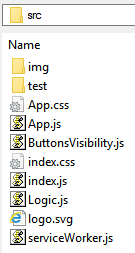
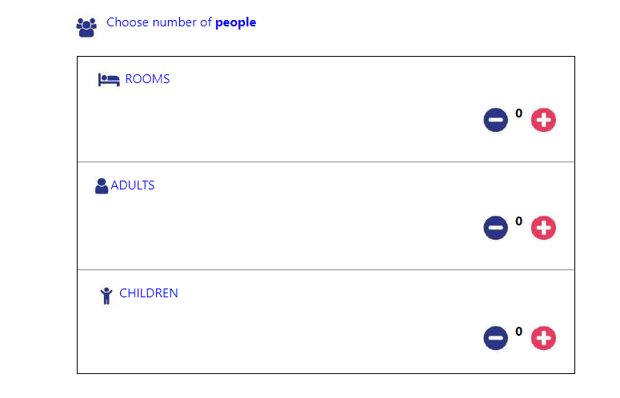

This sample shows how to create a Room Booking React application. In this application we are selecting rooms and how many persons including adult & child can stay in those rooms. 

In this project inside "src" folder, "App.js" is a main file which will render the components created in "Logic.js" which contains all code related to UI display and to "decrease" and "increase" rooms, adults and children. In "ButtonsVisibility.js" file there is code related to "Increase" and "Decrease" buttons for rooms, adults and children.

Here is the project structure of "src" folder.



## Demo

```bash
$ git clone https://github.com/meghakuc/room-b1.git
$ cd room-b1
$ npm start
$ open http://127.0.0.1:3000
```

Now, you visit http://127.0.0.1:3000/, and should see a room book app.



There are following places to test.

> 1. Initial state of Rooms, Adults and Children should be 0.
> 1. Decrease(-) button is disabled for Rooms, Adults and Children. 
> 1. Increase(+) button is enabled for Rooms, Adults and Children. 
> 1. Click (+) button on "Rooms", Adult count should also increase and its count should equal to room count. Child count should remain 0.
> 1. Click on (+) button on "Rooms". Decrease(-) button should be enabled.
> 1. Click on (+) button on "Rooms". Once room count will reach its max count i.e. 5, Increase(+) button should be disabled.
> 1. Click on (-) button on "Rooms". If room count is equals to adult count, room count and adult count should be decrease one point.
> 1. Click on (-) button on "Rooms". if persons(adult+child) count exceed maximum allowed, first child count should be decrease, if present then adult count should be decrease.
> 1. Click on (-) button on "Rooms". Once room count reached to 0, adult and child count should also be 0. Decrease(-) button should be disabled also.
> 1. Click on (+) button on "Adults". Decrease(-) button should be enabled. 
> 1. Click on (+) button on "Adults". If adult+child count is equal to room count*4, it should increase room count also along with adult count. Otherwise it should increase only adult count.
> 1. Click on (-) button on "Adults". If adult count is equal to room count, it should decrease room count also along with adult count.
> 1. Click on (+) button on "Children". Decrease(-) button should be enabled.
> 1. Click on (+) button on "Children". If adult+child count is less than to room count*4, it should increase only child count.
> 1. Click on (+) button on "Children". If adult+child count is equal to room count*4 and adult count is equal to room count , it should increase room, adult and child counts.
> 1. Click on (-) button on "Children". Child count should be decrease.
> 1. If adult+child count is equal to room count*4, Increase(+) button should be disabled for Rooms, Adults and Children.
